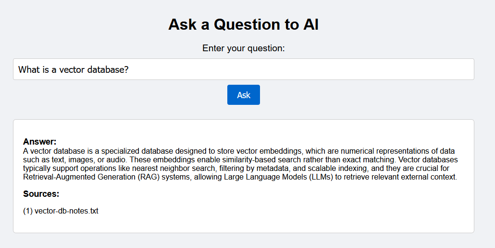
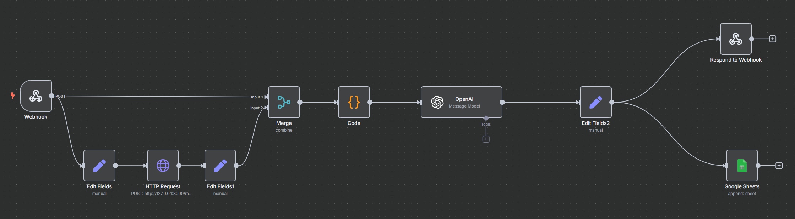
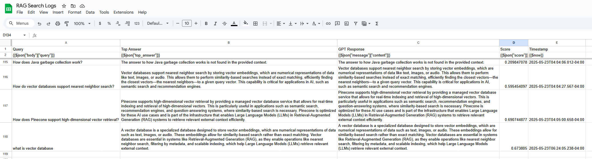

# 🤖 RAG Assistant: AI-Powered Q&A System using Pinecone, OpenAI & n8n

This project demonstrates a **production-grade Retrieval-Augmented Generation (RAG)** system that answers user questions by retrieving relevant knowledge from a vector database and generating context-aware answers using OpenAI.

Built as a real-world project to showcase **GenAI engineering**, **vector search**, and **workflow automation** — ideal for interviews, freelance demos, and AI/ML job portfolios.

---

## 🎯 Problem Solved

> How do you prevent LLM hallucinations while still answering questions from a private, evolving knowledge base?

✅ By retrieving only relevant context chunks using vector similarity search  
✅ Feeding those chunks to OpenAI with strict prompt constraints  
✅ Returning accurate, explainable answers — or falling back when needed

---

## 🧠 What This Project Does

- Accepts questions via a web UI
- Passes the query through a **FastAPI backend** + **Pinecone vector DB**
- Routes the logic using **n8n workflow**
- Uses **OpenAI GPT** only when high-confidence data exists
- Returns answers + document sources
- Logs all interactions in **Google Sheets**

---

## 💡 Key Highlights

| Capability                        | Description |
|----------------------------------|-------------|
| 🔍 **RAG Pipeline**              | Pinecone for retrieval, OpenAI for generation |
| 🧠 **Hallucination-safe output** | Score-based reliability check before generating |
| 🔗 **Frontend integration**      | Responsive HTML UI with deduplicated sources |
| 📊 **Logging**                   | Google Sheets used to track questions + answers |
| 🧪 **Tested for both paths**     | Works for relevant & irrelevant questions |
| 🧰 **Modular backend**           | Easily extendable with FastAPI + clean script separation |

---

## 🛠️ Tech Stack

- **FastAPI** — lightweight async Python API
- **OpenAI API** — context-based LLM generation
- **Pinecone** — high-speed vector database for semantic search
- **n8n** — low-code logic routing, retries, and fallbacks
- **HTML + JS** — minimal frontend to trigger queries
- **Google Sheets API** — audit logging layer

---

## 📁 Project Structure

```
rag-assistant-n8n-openai/
│
├── backend/          # FastAPI code: search, embedding, upsert, logic
├── n8n/              # n8n webhook handler + exported JSON flow
├── frontend/         # index.html with dynamic answer rendering
├── docs/             # Raw text used for embeddings
├── scripts/          # Test files for Pinecone, OpenAI, and embedding checks
├── .env.example      # Env vars template (no keys included)
├── requirements.txt  # Python dependencies
└── README.md         # You're reading it!
```

---

## ⚙️ How to Run It Locally

### 1. Clone the repo

```bash
git clone https://github.com/VibhavJaiswal/rag-assistant-n8n-openai
cd rag-assistant-n8n-openai
```

### 2. Set environment variables

- Copy `.env.example` to `.env`  
- Fill in your actual API keys (Pinecone + OpenAI)

### 3. Install Python dependencies

```bash
pip install -r requirements.txt
```

### 4. Start backend server

```bash
cd backend
uvicorn app:app --reload
```

### 5. Start frontend (HTML)

```bash
cd frontend
python -m http.server 5500
```

Visit: [http://localhost:5500](http://localhost:5500)

---

## 🖼️ Screenshots

| Web UI (Live Q&A) | n8n Flow | Google Sheet Logs |
|-------------------|----------|--------------------|
|  |  |  |

---

## 👤 Author

**Vibhav Jaiswal**  
AI/ML Engineer | Data Scientist | GenAI Solutions Builder   
📫 [LinkedIn](https://www.linkedin.com/in/vibhavjaiswal) • [GitHub](https://github.com/VibhavJaiswal)

---

## 🎯 Recruiter Note

> ✅ This project was designed to mirror real-world AI assistant systems that are safe, explainable, and modular.

It demonstrates:
- LLM integration in production environments
- Retrieval-based architecture with fallback handling
- Full-stack ownership (API + automation + UI + logging)

---

## 📜 License

MIT License